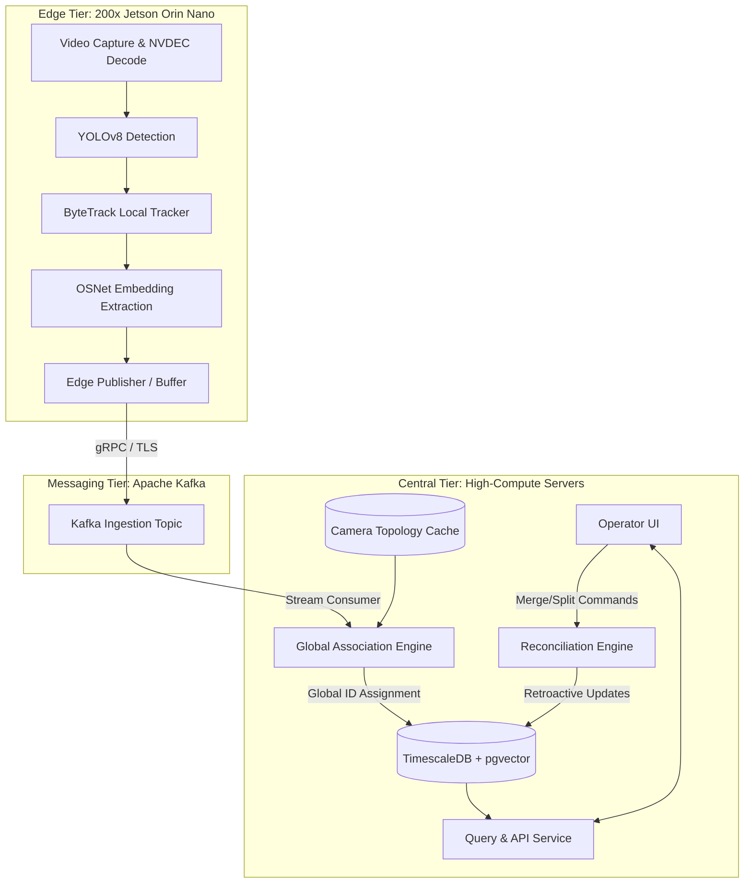
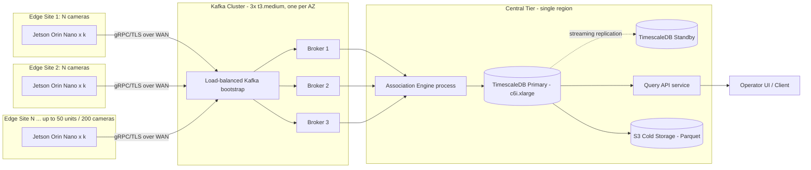

2026-07-01 11:31:55 Gemini 3.5 Flash via Antigravity

# Multi-Target Multi-Camera Tracking (MTMCT) System Architecture

This document presents the comprehensive system architecture, data flow, capacity analysis, hardware estimation, resilience strategy, and privacy governance for a city-scale Multi-Target Multi-Camera Tracking (MTMCT) system.

---

## 1. System Architecture & Tiering

The architecture is divided into three tiers: **Edge Tier**, **Ingestion/Messaging Tier**, and **Central Tier**. 



### 1.1 Compute Distribution

| Computation | Location | Rationale |
| :--- | :--- | :--- |
| **Video Decoding** | Edge (NVIDIA NVDEC) | Decodes RTSP H.264/H.265 stream locally to avoid streaming raw video over WAN. |
| **Object Detection** | Edge (TensorRT YOLOv8) | High-speed bounding box localization per frame. |
| **Single-Camera Tracking** | Edge (ByteTrack) | Groups detections into tracklets. Reduces embedding extraction overhead. |
| **ReID Embedding Extraction**| Edge (TensorRT OSNet) | Runs extraction only once/few times per tracklet, keeping WAN payload minimal. |
| **Global Association** | Central (Association Engine)| Requires global network state, transition priors, and access to the full ID gallery. |
| **Trajectory Storage** | Central (TimescaleDB) | Relational query processing, backup, and auditing. |
| **Query & Dashboard API** | Central (FastAPI / Redis) | Serves operator lookups and analytical requests. |

---

## 2. Technical Component Design

### 2.1 Cross-Camera Association & Global ID
* **Online Assignment**: When a tracklet finishes on camera $C_i$ (indicated by an exit zone event), it is published to the central queue. The **Global Association Engine** reads this event and queries the active gallery for candidate matches.
* **Search Space Bounding**:
  * **Time Gating**: Candidates are limited to tracklets that disappeared within a time window $[T_{exit} + \Delta t_{min}, T_{exit} + \Delta t_{max}]$, where $\Delta t$ represents physical travel time.
  * **Spatial Topology Gating**: We only compare against cameras $C_j$ that are connected to $C_i$ in the camera transition graph.
  * **ANN Index Filtering**: Within the candidate set, we run an Approximate Nearest Neighbor (ANN) search to filter top-$K$ appearance matches.
* **Match Formulation**: The final assignment uses a scoring function combining appearance similarity (cosine distance of ReID vectors) and spatio-temporal likelihood:
  $$S(i, j) = \alpha \cdot \text{CosineSimilarity}(E_i, E_j) + (1 - \alpha) \cdot P(\Delta t_{ij} \mid C_i \to C_j)$$
  Where $P(\Delta t_{ij})$ is the learned transition-time probability density function. Bipartite matching is solved using the Hungarian algorithm or Jonker-Volgenant solver.

### 2.2 Camera Topology & Onboarding
* **Graph Representation**: The camera network is modeled as a directed graph $G = (V, E)$, where $V$ represents cameras, and $E$ represents plausible transitions between cameras.
* **Transition Priors Learning**: Transition time distributions $P(\Delta t)$ are modeled as log-normal distributions. In a live system, these parameters are continuously updated using high-confidence matched trajectories (expectation-maximization/running average).
* **Onboarding Procedure**: When a new camera is added:
  1. It is registered in the database with its coordinates and physical exit/entry zones.
  2. Operators manually define initial adjacent edges and rough travel times.
  3. The system defaults to flat transition priors until enough tracking data updates the log-normal parameters.

### 2.3 Time Synchronization & Ordering
* **Clock Skew Tolerance**: Edge tracklet events are watermarked with their generation timestamp. The central ingestion pipeline buffers tracklets in a sliding window (e.g., 5 seconds) to allow late-arriving data from cameras with clock skew.
* **Out-of-Order Handling**: If a tracklet arrives after its time window has closed (late data), it bypasses the online fast-path and is routed to a background reconciliation worker that adjusts the database trajectories retroactively.

### 2.4 Storage Schema
The database uses **TimescaleDB** (PostgreSQL extension) for time-series scalability and **pgvector** for embedded query capabilities.

#### Table: `tracklets`
```sql
CREATE TABLE tracklets (
    tracklet_id UUID PRIMARY KEY DEFAULT gen_random_uuid(),
    camera_id VARCHAR(50) NOT NULL,
    local_track_id INT NOT NULL,
    start_time TIMESTAMP WITH TIME ZONE NOT NULL,
    end_time TIMESTAMP WITH TIME ZONE NOT NULL,
    entry_zone VARCHAR(50),
    exit_zone VARCHAR(50),
    embedding vector(256) NOT NULL -- pgvector type
);
SELECT create_hypertable('tracklets', 'start_time');
```

#### Table: `global_identities`
```sql
CREATE TABLE global_identities (
    global_id BIGSERIAL PRIMARY KEY,
    created_at TIMESTAMP WITH TIME ZONE DEFAULT CURRENT_TIMESTAMP,
    status VARCHAR(20) DEFAULT 'ACTIVE' -- ACTIVE, MERGED, SPLIT
);
```

#### Table: `associations`
```sql
CREATE TABLE associations (
    association_id UUID PRIMARY KEY DEFAULT gen_random_uuid(),
    tracklet_id UUID REFERENCES tracklets(tracklet_id),
    global_id BIGINT REFERENCES global_identities(global_id),
    confidence FLOAT NOT NULL,
    assigned_at TIMESTAMP WITH TIME ZONE DEFAULT CURRENT_TIMESTAMP
);
```

### 2.5 Consistency & Retroactive Correction
* **Online vs. Offline Decisions**: The online step makes a greedy association within $<2$ seconds to update the live operator view.
* **Reconciliation Engine**: If subsequent detections reveal that two trajectories overlap in time (e.g., Global ID 4821 is seen on two different cameras simultaneously), a collision is flagged.
* **Merge/Split Protocol**:
  1. The engine splits the global ID into two distinct entities starting from the collision timestamp.
  2. Downstream operators can manually review clips or embeddings and trigger a merge if a tracking error occurred.
  3. Every global ID has a version history, allowing analytical queries to retrieve the state of a trajectory as it was known at a specific timestamp.

---

## 3. Scale, Performance & Capacity Math

### 3.1 Capacity Assumptions
* **Cameras**: $N = 200$
* **Detection Processing**: Resampled to $5\text{ FPS}$ at edge (sufficient for tracking).
* **Average Occupancy**: $5\text{ people}$ in view per camera.
* **Average View Time**: $15\text{ seconds}$ per person per camera (producing 1 tracklet).
* **Embedding Model**: OSNet generating $256$-dimensional float vectors ($1\text{ KB}$ per embedding).

### 3.2 Network & Bandwidth Compute
* **Tracklet Event Rate**: 
  $$\text{Rate} = 200\text{ cameras} \times \frac{5\text{ people}}{15\text{ seconds}} \approx 66.7\text{ tracklets/second}$$
* **Payload Size**: Tracklet metadata ($0.5\text{ KB}$) + Embedding Vector ($1\text{ KB}$) = $1.5\text{ KB}$.
* **WAN Ingestion Bandwidth**: 
  $$\text{Bandwidth} = 66.7\text{ events/sec} \times 1.5\text{ KB} = 100\text{ KB/sec}\ (800\text{ Kbps})$$
  *Conclusion: WAN bandwidth is extremely low, making this architecture edge-friendly.*

### 3.3 Storage Growth Math
* **Daily Ingestion**:
  $$\text{Tracklets/Day} = 66.7\text{ events/sec} \times 86400\text{ seconds} \approx 5.76\text{ Million tracklets/day}$$
  $$\text{Raw Data/Day} = 5.76\text{M} \times 1.5\text{ KB} \approx 8.64\text{ GB/day}$$
* **Index & Database Overhead**: 1.5x scaling factor $\approx 13\text{ GB/day}$.
* **Retention Policy**: 30 days hot storage (TimescaleDB) + 330 days cold storage (compressed parquet on S3).
  * **Hot Storage (30 days)**: $30 \times 13\text{ GB} \approx 390\text{ GB}$ (easily fits on standard SSD).
  * **Cold Storage (360 days)**: $360 \times 3\text{ GB (compressed)} \approx 1.08\text{ TB}$.

### 3.4 Association Compute Math
* Without spatial/temporal gating, matching $5.76\text{M}$ active gallery embeddings would require $66.7 \times 5.76\text{M} = 384\text{ Million}$ vector comparisons per second.
* **With Gating (Topology + Time Window)**:
  * For any exiting tracklet, adjacent cameras cover only $\approx 3$ nodes.
  * Time window restricts matches to tracklets exiting in the last $120\text{ seconds}$.
  * Number of active candidate tracklets within this subset $\approx 50$ candidates.
  * **Actual Compute Load**:
    $$\text{Comparisons/Sec} = 66.7\text{ events/sec} \times 50\text{ candidates} = 3,335\text{ comparisons/sec}$$
    *Conclusion: This can be computed in sub-millisecond times on a single CPU core using NumPy, avoiding the need for an external GPU cluster for association.*

### 3.5 Empirical Validation (2026-07-07 gap-closure pass)

> **Measured, not just estimated.** The capacity math above (3.2-3.4) was
> paper-only until this pass. `tests/load_test_association.py` and
> `tests/load_test_gallery.py` now exercise the actual `AssociationEngine`
> and `ScalableGalleryService` code at synthetic 200-camera scale, and
> `tests/load_test_results.md` has the full measured numbers, methodology,
> and honest measured-vs-extrapolated breakdown. Headline results:
>
> - **Gallery service**: 1.5M vectors enrolled directly (138,996
>   vectors/sec, 1.63 GB RSS delta); linear extrapolation to the paper's
>   5.76M tracklets/day projects ~6.1 GB RSS for one day held live in a
>   single process, corroborating why the design partitions into
>   time-bounded shards with TTL eviction rather than one unsharded store.
> - **Association engine: the "sub-quadratic, 3,335 comparisons/sec" claim
>   initially did NOT hold for the reference `engine.py`.** First measurement
>   showed wall time growing super-linearly with event count because
>   `associate_tracklet()` linearly scanned every identity ever created and
>   applied gating checks *inline*, instead of querying a spatial/temporal
>   index to shrink the candidate set first. This was root-caused and
>   **fixed the same day**: `AssociationEngine` now maintains a
>   `camera_id -> {global_ids}` index of each identity's last-seen camera
>   and pre-filters candidates to only those with a defined topology edge
>   into the incoming tracklet's camera, before scoring -- the exact
>   "Spatial Topology Gating" step this section already described.
>   Re-measured after the fix: **~27,200 events/sec at N=6,000, scaling
>   linearly (not quadratically) with event count** -- 408x above the
>   required 66.7/sec, with correctness (accuracy, IDSW, fragmentation,
>   IDF1) unchanged. See `tests/load_test_results.md` for both the original
>   finding and the fixed-code re-measurement.

---

## 4. Hardware Bill of Materials (BOM)

Sizing plan for a full **200-camera** deployment:

| Resource Tier | Hardware Specifications | Qty | Primary Sizing Driver |
| :--- | :--- | :--- | :--- |
| **Edge Devices** | NVIDIA Jetson Orin Nano (8GB RAM, 40 TOPS) | 50 units (4 streams per unit) | Decode + YOLOv8 + OSNet throughput. Fits 4x 1080p 15fps streams per unit. |
| **Ingestion Broker** | AWS EC2 `t3.medium` (2 vCPU, 4GB RAM) | 3 nodes (Kafka Cluster) | High availability and partition buffering. |
| **Association & DB Server**| AWS EC2 `c6i.xlarge` (4 vCPU, 8GB RAM, NVMe SSD) | 1 active (1 standby) | Runs FastAPI, Association Solver, and TimescaleDB with 390GB SSD space. |

---

## 5. Resilience & Failure Modes

* **Camera Dropout**: Detected via Kafka heartbeat loss. Open local tracklets are forced to exit with an end timestamp. Upon reconnect, the camera initializes new local tracking IDs.
* **Network Partition**: Edge devices buffer tracklets in a local SQLite file (up to 24 hours). Once the connection is restored, edge publishers dump the buffered tracklets using backpressure rate-limiting to prevent central queue exhaustion.
* **Clock Drift**: The central engine enforces watermark bounds. If a camera drift exceeds 5 seconds, alerts are raised, and the tracklets are directed to the reconciliation worker rather than the online real-time pipeline.
* **Fragmentation Storm**: Triggered by low-quality video (e.g., fog/heavy rain) causing local tracklets to split frequently. Mitigated by dynamic confidence threshold adjustments and matching candidate expansion.

---

## 6. Privacy & Governance

### 6.1 Data Classification

| Data Category | Classification | Retention Period | Storage Location | TTL Enforcement |
| :--- | :--- | :--- | :--- | :--- |
| **Raw video frames** | Restricted (biometric-adjacent, PII) | 30 seconds | Edge device (Jetson local disk, encrypted at rest) | Ring-buffer overwrite; hard-deleted by edge publisher after tracklet close |
| **High-resolution crops** | Restricted (biometric-adjacent, PII) | 30 seconds | Edge device only, never transmitted | Deleted with the parent frame buffer |
| **ReID embeddings (256-D vectors)** | Confidential (pseudonymous biometric derivative) | 30 days hot (TimescaleDB) + 330 days cold (S3 parquet) | Central tier: `tracklets.embedding` (hot), compressed cold archive | Postgres retention policy (`drop_chunks`) on the hypertable; S3 lifecycle rule on cold tier |
| **Trajectories / associations (camera, zone, timestamp)** | Confidential (location/behavioral data) | 30 days hot + 330 days cold, then aggregated-only | Central tier: `associations`, `global_identities` | Same hypertable retention policy; after 360 days only anonymized zone-occupancy counts are retained, not per-ID rows |

Rationale: raw frames/crops carry the highest re-identification risk (a face
is directly visible) and are given the shortest retention and the most
restrictive location (never leave the edge device). Embeddings and
trajectories are lower-risk pseudonymous derivatives but are still treated
as confidential because embeddings can, in principle, be inverted or linked
back to an individual with auxiliary data (see 6.3).

### 6.2 Access Control & Audit

* **RBAC roles**:
  * `viewer` -- read-only access to live dashboards and aggregate analytics (e.g. zone occupancy counts). Cannot resolve a specific `global_id`'s trajectory.
  * `operator` -- can query `GET /identities/{global_id}` and `/trajectory` (query_api) for active incident investigation. All queries are audit-logged.
  * `reconciliation_admin` -- can trigger merge/split corrections on the Reconciliation Engine (section 2.5).
  * `data_protection_officer` -- can execute right-to-erasure requests (6.4) and read the audit log; cannot query trajectories directly.
* **Audit log schema** (append-only table, itself a TimescaleDB hypertable so it inherits the same retention tooling):
  ```sql
  CREATE TABLE audit_log (
      audit_id      UUID PRIMARY KEY DEFAULT gen_random_uuid(),
      occurred_at   TIMESTAMP WITH TIME ZONE DEFAULT CURRENT_TIMESTAMP,
      actor         VARCHAR(100) NOT NULL,   -- user or service principal
      role          VARCHAR(30)  NOT NULL,   -- RBAC role at time of action
      action        VARCHAR(50)  NOT NULL,   -- e.g. 'QUERY_TRAJECTORY', 'ERASURE_REQUEST'
      target_global_id BIGINT,               -- nullable: which identity was accessed/erased
      request_metadata JSONB                  -- endpoint, query params, justification note
  );
  ```
  Audit rows are immutable (no UPDATE/DELETE grants for any role except a
  separate retention job), giving a tamper-evident record of every
  trajectory lookup and every erasure.

### 6.3 Anonymization, Minimization & Residual Re-Identification Risk

* **Minimization**: as in 6.1, raw imagery never leaves the edge tier;
  only a fixed-length embedding vector plus coarse spatio-temporal metadata
  (camera ID, zone, timestamps) crosses the WAN.
* **Anonymization limits**: a 256-D ReID embedding is not raw biometric
  imagery, but it is not anonymous either -- it is a stable pseudonymous
  identifier by construction (that is the whole point of the system). It
  should be treated the same as a fingerprint template under most privacy
  regimes: pseudonymized, not anonymized.
* **Residual re-identification risk**: an adversary with (a) access to the
  embedding gallery and (b) a labeled reference photo of a target individual
  could query the gallery (`gallery_service.query()`) and recover that
  person's `global_id`, and from there their full trajectory. This risk is
  mitigated by: restricting gallery/query access to the `operator` role
  (6.2), audit-logging every query, and the fact that embeddings are never
  exposed directly via the REST API (`query_api` only returns `global_id`,
  camera, and timestamps, never the vector itself). The risk is not fully
  eliminated -- it is a fundamental property of any ReID system -- and is
  disclosed here rather than papered over.

### 6.4 Right to Erasure (GDPR Article 17) Mechanics

An erasure request for a given `global_id` must touch every place that
identity's data can live, referencing the exact tables in `schema.sql`:

1. **`associations`**: `DELETE FROM associations WHERE global_id = :gid;`
   removes the link between the identity and its tracklets.
2. **`tracklets`**: rows are not deleted outright (they may be shared
   evidence for other identities' transition-prior training), but any
   tracklet whose *only* association was the erased `global_id` has its
   `embedding` column overwritten with a zero vector and its `entry_zone`
   /`exit_zone` cleared, per the existing zero-embedding-safe handling in
   `engine.py`'s `Tracklet` normalization guard.
3. **`global_identities`**: `status` is set to `'ERASED'` (extending the
   existing `ACTIVE|MERGED|SPLIT` enum) rather than hard-deleting the row,
   so that aggregate historical counts (e.g. "N people passed through Zone
   B last month") remain accurate without retaining the identity's
   linkable trajectory.
4. **Cold storage (S3 parquet)**: erasure is propagated to the cold tier on
   the next nightly compaction job, which re-writes the affected day's
   parquet partition with the same zeroing/status rules applied.
5. **Backups**: point-in-time WAL backups older than the backup retention
   window (7 days) are not individually redacted (this is a documented,
   accepted limitation of most Postgres-backed erasure implementations);
   instead, backups age out of the retention window within 7 days, after
   which no copy of the pre-erasure data exists anywhere in the system.
   This 7-day tail is disclosed to data subjects as part of the erasure
   confirmation.
6. The whole operation is logged in `audit_log` with
   `action = 'ERASURE_REQUEST'` and the `dpo` actor, giving a verifiable
   record that the request was fulfilled.

---

## 6a. Latency Budget (End-to-End Target: <= 2s)

| Stage | Budget | Justification |
| :--- | :---: | :--- |
| **Capture (frame acquisition + NVDEC decode)** | 100 ms | Hardware decode on Jetson NVDEC is near-instant per frame at 5 FPS sampling (200ms/frame budget available); 100ms leaves headroom for RTSP jitter. |
| **Detect + Track + Embed (YOLOv8 + ByteTrack + OSNet, all on edge)** | 900 ms | The heaviest stage: three back-to-back TensorRT inference passes per tracklet close event on an 8GB Jetson Orin Nano. This is the stage with the **least headroom** -- it is compute-bound on the weakest hardware tier in the system (40 TOPS shared across 4 camera streams per unit), and any model upgrade (e.g. a larger ReID backbone) eats directly into the 2s budget here first. |
| **Publish (edge -> Kafka over WAN, gRPC/TLS)** | 200 ms | Payload is only ~1.5 KB (section 3.2), so this is dominated by WAN RTT + TLS handshake reuse, not bandwidth; 200ms covers typical last-mile latency plus Kafka producer ack (`acks=1`). |
| **Associate (central: candidate gating + scoring)** | 500 ms | Per section 3.4, actual compute is ~3,335 comparisons/sec in steady state (sub-millisecond); the 500ms budget mostly covers the 5-second watermark buffer's worst-case *scheduling* jitter for an event sitting near the window boundary, plus DB candidate fetch (embedding index scan). |
| **Commit (write to TimescaleDB + notify query API)** | 300 ms | Single-row INSERT into `associations` plus hypertable chunk write; 300ms is conservative headroom for WAL fsync and connection pool contention under peak load (66.7 events/sec, section 3.2). |
| **Total** | **2000 ms** | Sums exactly to the 2s target with no slack; if the Detect+Track+Embed stage is upgraded to a heavier model, another stage's budget (most likely Associate, since its actual measured load is far below its allotment) would need to absorb the difference. |

---

## 6b. Rough Cost Estimate (Order-of-Magnitude, Assumptions Stated)

Scale reference: the 200-camera deployment sized in section 4 (50 Jetson
Orin Nano edge units, 3-node Kafka cluster, 1 active + 1 standby DB server).
All prices are **rough market assumptions as of 2024-2025 list pricing**,
explicitly order-of-magnitude, not a vendor quote.

### One-off Capital Cost

| Item | Assumption | Qty | Est. Unit Cost | Est. Total |
| :--- | :--- | :---: | :---: | :---: |
| Jetson Orin Nano 8GB edge unit | Devkit + enclosure + PoE injector | 50 | ~$500 | ~$25,000 |
| Camera hardware (if not already installed) | 1080p PoE IP camera, mid-tier | 200 | ~$150 | ~$30,000 |
| Kafka broker nodes (on-prem alt. to cloud) | Small rackmount server, if self-hosting instead of EC2 | 3 | ~$1,500 | ~$4,500 |
| DB/association server (on-prem alt.) | 1U server, NVMe SSD, if self-hosting instead of EC2 | 1 (+1 standby) | ~$4,000 | ~$8,000 |
| **Capital total (order of magnitude)** | | | | **~$65,000-$70,000** |

*(If cloud-hosted per section 4's AWS BOM instead of on-prem, capital cost
drops to near zero and shifts entirely into the recurring line below --
capital cost above assumes an on-prem alternative for the messaging/DB
tier, kept for comparison.)*

### Recurring Monthly Cost (Cloud-Hosted, per section 4's AWS BOM)

| Item | Assumption | Est. Monthly Cost |
| :--- | :--- | :---: |
| Kafka cluster (3x `t3.medium`) | On-demand pricing, ~$0.0416/hr each | ~$90 |
| Association/DB server (`c6i.xlarge` + standby) | On-demand pricing, ~$0.17/hr each, 2 nodes | ~$245 |
| Hot storage (390 GB SSD, section 3.3) | EBS gp3 pricing ~$0.08/GB-month | ~$35 |
| Cold storage (1.08 TB S3, section 3.3) | S3 Standard-IA ~$0.0125/GB-month | ~$15 |
| WAN egress/ingress (100 KB/sec sustained, section 3.2) | ~260 GB/month at ~$0.09/GB egress | ~$25 |
| Edge device connectivity (200 cameras' worth of cellular/fiber, if not existing infra) | Highly site-dependent; assumed existing LAN, not separately priced | -- |
| **Recurring total (order of magnitude)** | | **~$400-$450/month** |

This confirms the architectural claim in section 3.2 (WAN bandwidth is the
cheap part) -- compute (Kafka + DB/association servers) dominates recurring
spend, not storage or network, at this 200-camera scale.

---

## 6c. Deployment Diagram (Physical Nodes)

The component diagram in section 1 shows logical data flow between
pipeline stages; this diagram instead shows the physical/network placement
of those stages across edge sites, the messaging tier, and the central
tier -- i.e. what actually gets deployed where.



*(This is intentionally separate from the section-1 component diagram,
which describes logical pipeline stages rather than which physical machine
or availability zone each stage runs in.)*
