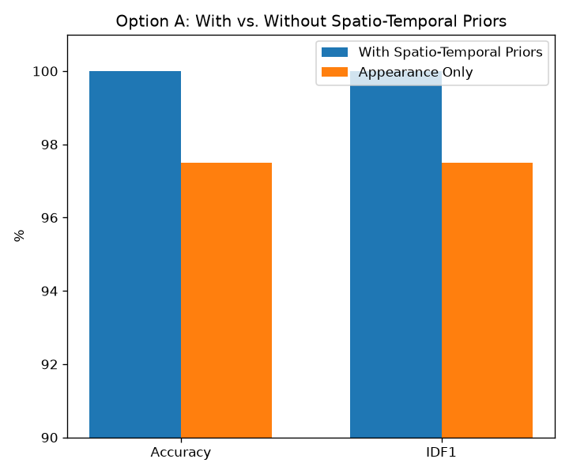
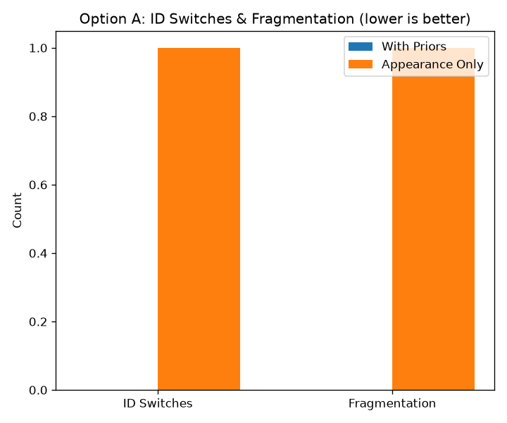

# MTMCT Association Engine (Option A)

This repository contains the working prototype for the **Cross-Camera Association Engine** (Build Component Option A), designed for the Multi-Target Multi-Camera Tracking (MTMCT) system.

> **Note on scope**: task.pdf section 7 asks for exactly ONE of Option A or
> Option B. We built and measured both (this is Option A; Option B lives in
> `../gallery_service/`), and they're wired together end-to-end via
> `integration_demo.py` below. This is a deliberate over-delivery, not a
> misreading of the requirement -- flagged here explicitly so it reads as an
> intentional choice rather than an oversight.

## Overview
The association engine assigns globally unique identities to local tracklets arriving from multiple edge cameras. To ensure high accuracy and low ID switches, it fuses:
1. **Appearance Similarity**: Cosine distance between 256-D (or 128-D in this simulation) ReID feature embeddings.
2. **Spatio-Temporal Constraints**: Leveraging a camera topology graph and transition-time priors to ensure a person moves through the network in a physically plausible manner.

## Repository Contents
* `engine.py`: The core Global Association Engine containing the `Tracklet`, `CameraTopology`, and `AssociationEngine` classes. Implements time-gating and log-normal probability transition scoring.
* `generator.py`: A synthetic data generator that simulates 20 people moving through a 5-camera network. It introduces noise and explicit "lookalike" embeddings to challenge the engine.
* `evaluate.py`: Calculates MOT/ReID metrics including accuracy (dominant match), ID switches (IDSW), and Fragmentation (FM).
* `run.py`: The main execution script. It generates the synthetic data, runs the engine with and without spatio-temporal priors, and outputs a comparative benchmark.
* `evaluation_results.md`: The output metrics report from the latest run.

## Setup & Execution

### Prerequisites
* Python 3.8+
* `numpy`

```bash
# Install dependencies
pip install numpy
```

### Running the Evaluation
To run the engine and generate the metrics, execute the following command from the **project root** (this makes the relative package imports resolve correctly):

```bash
python3 -m association_engine.src.run
```

(`python run.py` from inside `src/` also works as a fallback, thanks to a try/except import in `run.py`.)

This will output the metrics to the console -- including **IDF1**, ID switches, and fragmentation -- and write the formatted results to `src/evaluation_results.md`.

## Integration with Option B (Gallery Service)

`src/integration_demo.py` proves Option A and Option B actually compose:
every `AssociationEngine.associate_tracklet()` decision is enrolled into
`gallery_service`'s `ScalableGalleryService`, and a fresh noisy query is
shown to retrieve the correct `global_id` back out of the gallery. Run it
with:

```bash
python3 -m association_engine.src.integration_demo
```

## Methodology
To demonstrate the necessity of spatio-temporal constraints, the synthetic generator explicitly spawns two identities ("Person 1" and "Person 2") that have near-identical ReID embeddings.

When evaluating **without priors** (appearance only), the engine frequently confuses these identities, leading to ID switches. When evaluating **with priors** (the default system architecture), the engine recognizes that it is physically impossible for the identity to traverse the network instantly, preventing the false merge and maintaining a stable Global ID.

## Evaluation Plots





Numbers behind these charts are in `evaluation_results.md` (accuracy 100.0%
with priors vs. 97.5% without; 0 ID switches / 0 fragmentation with priors
vs. 1 / 1 without).
