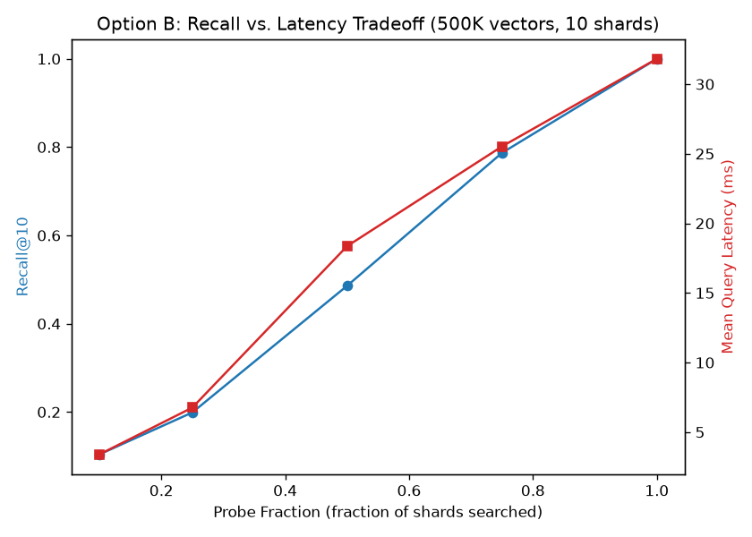
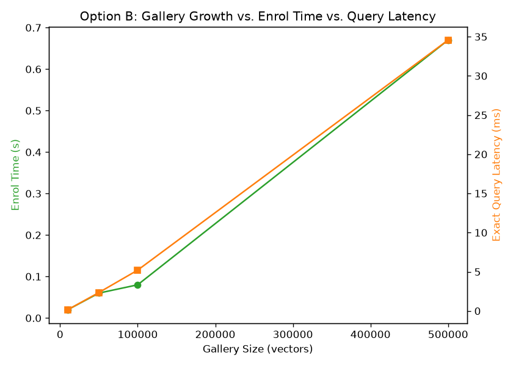

# MTMCT Scalable Gallery Service (Option B)

Working prototype for the **Scalable Embedding-Gallery Service** (Build
Component Option B). Implements sharded exact vector search with
`enrol` / `query` / `evict` interfaces, O(1) shard-level eviction, and an
ANN-style `probe_fraction` sampling knob for a real recall/latency tradeoff.

> **Note on scope**: task.pdf section 7 asks for exactly ONE of Option A or
> Option B. We built and measured both (this is Option B; Option A lives in
> `../association_engine/`), wired together end-to-end via
> `integration_demo.py` below. Deliberate over-delivery, flagged explicitly.

## Repository Contents
* `src/service.py`: `ScalableGalleryService` (sharded, NumPy-vectorized exact
  nearest-neighbor search) and `GalleryShard`.
* `src/benchmark.py`: Benchmarks enrol/query latency and eviction cost as
  gallery size grows.
* `src/benchmark_report.md`: Summary of benchmark results.

## Integration with Option A (Association Engine)

`association_engine/src/integration_demo.py` proves Option A and Option B
compose end-to-end: every association decision made by
`AssociationEngine.associate_tracklet()` is enrolled into
`ScalableGalleryService`, and a fresh noisy embedding query is shown to
retrieve the correct `global_id` back out. Run it with:

```bash
python3 -m association_engine.src.integration_demo
```

## Evaluation Plots





Full numbers in `src/benchmark_report.md`. Headline: dropping
`probe_fraction` from 1.0 (exact) to 0.1 cuts mean query latency ~9.4x
(31.8ms -> 3.4ms at 500K vectors / 10 shards) at the cost of recall@10
falling from 1.000 to 0.104 -- the explicit recall traded away for latency
that task.pdf section 7 (Option B) asks for.
